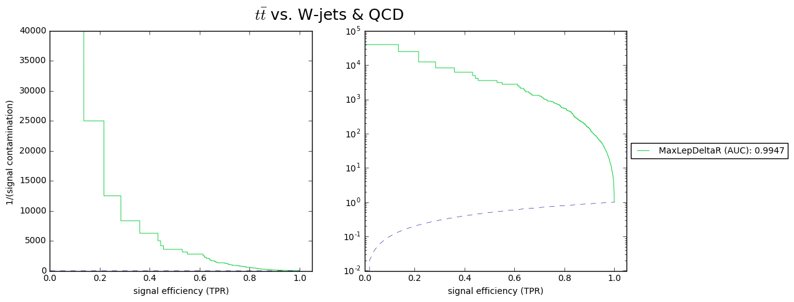
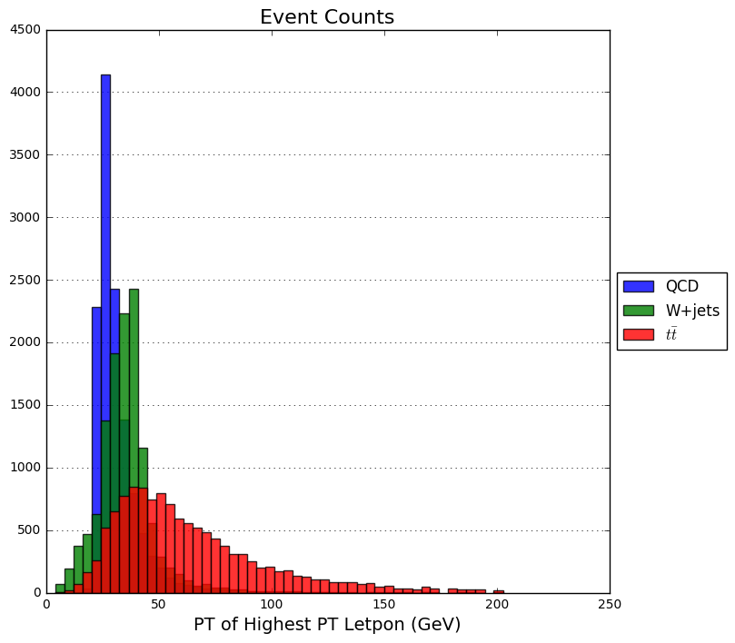
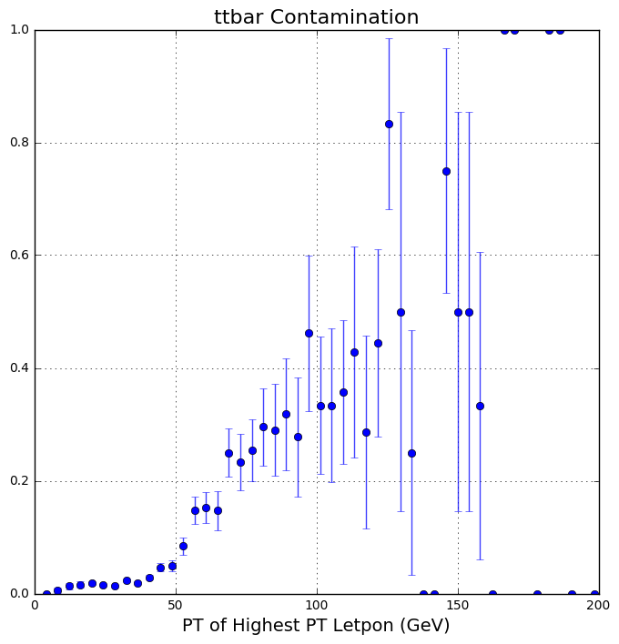

Postprocessing Example
======================

Add directory containing CMS\_Deep\_Learning repo to the sys path. `repo <https://github.com/DannyWeitekamp/CMS_Deep_Learning/>`__ `docs <https://dannyweitekamp.github.io/CMS_Deep_Learning/index.html>`__
-----------------------------------------------------------------------------------------------------------------------------------------------------------------------------------------------------------

.. code:: ipython2

    %matplotlib inline
    if __package__ is None:
        import sys, os
        os.environ["CUDA_VISIBLE_DEVICES"] = '3'
        sys.path.append(os.path.realpath("/data/shared/Software/CMS_Deep_Learning"))

Import stuff
------------

.. code:: ipython2

    from CMS_Deep_Learning.postprocessing.plot import \
                plot_roc_curve,plot_dual_roc,plot_bins
    from CMS_Deep_Learning.postprocessing.metrics import \
                build_accumulator,bin_metric_vs_char,get_roc_data,get_roc_points
    import numpy as np
    import pandas as pd
    import glob
    os.environ["DELPHES_DIR"] = "/bigdata/shared/Delphes"

We will make plots from a subset of the data data here on the culture-plate machine
-----------------------------------------------------------------------------------

.. code:: ipython2

    dirr = '/bigdata/shared/Delphes/postproc_ex'
    data_subset = glob.glob(dirr+"/val/*.h5")[:5]

Plot a ROC Curve with `plot\_roc\_curve <https://dannyweitekamp.github.io/CMS_Deep_Learning/build/html/postprocessing.html#CMS_Deep_Learning.postprocessing.plot.plot_bins>`__ (be patient, it takes a long time to grab the data)
----------------------------------------------------------------------------------------------------------------------------------------------------------------------------------------------------------------------------------

.. code:: ipython2

    _,roc_dicts = plot_roc_curve(name="MaxLepDeltaR",
                    input_keys="Particles", #Or ["HCAL", "ECAL"]
                    label_keys="Labels", #Or ["target"]
                    model=dirr +"/model.json",
                   weights=dirr +"/weights.h5",
                   data= data_subset,
                   true_class_index=1)

.. parsed-literal::

    Using Theano backend.
    Using cuDNN version 5105 on context None
    Mapped name None to device cuda: GeForce GTX 1080 (0000:07:00.0)

.. image:: postprocessing_example_files/postprocessing_example_8_1.png

Plot The same ROC curve quickly by using the precomputed data outputed in the previous cell. These ploting functions are very dynamic. You can input file paths, data, precomputed values and more.
---------------------------------------------------------------------------------------------------------------------------------------------------------------------------------------------------

.. code:: ipython2

    plot_roc_curve(roc_dicts)

.. image:: postprocessing_example_files/postprocessing_example_10_0.png

.. parsed-literal::

    (<module 'matplotlib.pyplot' from '/usr/local/lib/python2.7/dist-packages/matplotlib/pyplot.pyc'>,
     [{'ROC_data': (array([ 0.     ,  0.     ,  0.     , ...,  0.97988,  0.97988,  1.     ]),
        array([  8.00000000e-05,   1.68000000e-03,   1.84000000e-03, ...,
                 9.99920000e-01,   1.00000000e+00,   1.00000000e+00]),
        array([  9.99759734e-01,   9.99743998e-01,   9.99743760e-01, ...,
                 5.58113243e-05,   5.58094653e-05,   8.57259522e-07], dtype=float32),
        0.99469489440000025),
       'name': 'MaxLepDeltaR'}])

Use `plot\_dual\_roc <https://dannyweitekamp.github.io/CMS_Deep_Learning/build/html/postprocessing.html#CMS_Deep_Learning.postprocessing.plot.plot_dual_roc>`__ to also plot logscale
-------------------------------------------------------------------------------------------------------------------------------------------------------------------------------------

.. code:: ipython2

    plt, roc_dicts = plot_dual_roc(name="MaxLepDeltaR",
                    input_keys="Particles", #Or ["HCAL", "ECAL:]
                    label_keys="Labels", #Or ["target"]
                    model=dirr +"/model.json",
                   weights=dirr +"/weights.h5",
                   data= data_subset,#dirr +"/val",
                   true_class_index=1,flipped=False, invertCont=False, title=r'$t\bar{t}$ vs. W-jets & QCD')

.. parsed-literal::

    /usr/local/lib/python2.7/dist-packages/matplotlib/font_manager.py:1288: UserWarning: findfont: Font family [u'sans-serif'] not found. Falling back to Bitstream Vera Sans
      (prop.get_family(), self.defaultFamily[fontext]))

.. image:: postprocessing_example_files/postprocessing_example_12_1.png

Different formatting options availiable...
------------------------------------------

.. code:: ipython2

    plot_dual_roc(roc_dicts,flipped=True, invertCont=False, title=r'$t\bar{t}$ vs. W-jets & QCD')
    plot_dual_roc(roc_dicts,flipped=True, invertCont=True, title=r'$t\bar{t}$ vs. W-jets & QCD')
    plot_dual_roc(roc_dicts,flipped=False, invertCont=False, title=r'$t\bar{t}$ vs. W-jets & QCD')
    plot_dual_roc(roc_dicts,flipped=False, invertCont=True, title=r'$t\bar{t}$ vs. W-jets & QCD')

.. parsed-literal::

    (<module 'matplotlib.pyplot' from '/usr/local/lib/python2.7/dist-packages/matplotlib/pyplot.pyc'>,
     [{'ROC_data': (array([ 0.     ,  0.     ,  0.     , ...,  0.97988,  0.97988,  1.     ]),
        array([  8.00000000e-05,   1.68000000e-03,   1.84000000e-03, ...,
                 9.99920000e-01,   1.00000000e+00,   1.00000000e+00]),
        array([  9.99759734e-01,   9.99743998e-01,   9.99743760e-01, ...,
                 5.58113243e-05,   5.58094653e-05,   8.57259522e-07], dtype=float32),
        0.99469489440000025),
       'name': 'MaxLepDeltaR'}])

.. image:: postprocessing_example_files/postprocessing_example_14_1.png

.. image:: postprocessing_example_files/postprocessing_example_14_3.png

.. image:: postprocessing_example_files/postprocessing_example_14_4.png

## Use
`get\_roc\_points <https://dannyweitekamp.github.io/CMS_Deep_Learning/build/html/postprocessing.html#CMS_Deep_Learning.postprocessing.metrics.get_roc_points>`__
to determine the efficiency (tpr) and contamination (fpr) for various
thresholds

.. code:: ipython2

    d = get_roc_points(roc_dicts, tpr=[.9,.95,.8], fpr=[.1], thresh=[.33])[0]
    print(pd.DataFrame(d,columns=["tpr","fpr", "thresh"]))

.. parsed-literal::

           tpr      fpr    thresh
    0  0.98896  0.09928  0.053954
    1  0.89992  0.00696  0.804488
    2  0.95008  0.01832  0.493277
    3  0.80144  0.00180  0.957207
    4  0.96448  0.02868  0.329533

Use `build\_accumulator <https://dannyweitekamp.github.io/CMS_Deep_Learning/build/html/postprocessing.html#CMS_Deep_Learning.postprocessing.metrics.build_accumulator>`__ to define some characteristic to use for binning. The accumulator is a functional that maps the data to a characteristic. Then use `bin\_metric\_vs\_char <https://dannyweitekamp.github.io/CMS_Deep_Learning/build/html/postprocessing.html#CMS_Deep_Learning.postprocessing.metrics.bin_metric_vs_char>`__ to make the bins. Although certain features can be grabbed without an accumulator from the HLF collection.
-------------------------------------------------------------------------------------------------------------------------------------------------------------------------------------------------------------------------------------------------------------------------------------------------------------------------------------------------------------------------------------------------------------------------------------------------------------------------------------------------------------------------------------------------------------------------------------------------

.. code:: ipython2

    accum = build_accumulator(np.max, "Pt",[{'isChHad': 1}, {'isGamma': 1}, {'isEle':1}])
    my_bins = bin_metric_vs_char(model=dirr +"/model.json",
                    input_keys="Particles", #Or ["HCAL", "ECAL:]
                    label_keys="Labels", #Or ["target"]
                   weights=dirr +"/weights.h5",
                   data=data_subset,#dirr +"/val",
                    accumulate=accum,true_class_index=1)

.. parsed-literal::

    /usr/lib/python2.7/dist-packages/numpy/core/_methods.py:82: RuntimeWarning: Degrees of freedom <= 0 for slice
      warnings.warn("Degrees of freedom <= 0 for slice", RuntimeWarning)
    /usr/lib/python2.7/dist-packages/numpy/core/_methods.py:59: RuntimeWarning: Mean of empty slice.
      warnings.warn("Mean of empty slice.", RuntimeWarning)

Use `plot\_bins <https://dannyweitekamp.github.io/CMS_Deep_Learning/build/html/postprocessing.html#CMS_Deep_Learning.postprocessing.plot.plot_bins>`__ and choose a y\_value for the plot.
------------------------------------------------------------------------------------------------------------------------------------------------------------------------------------------

.. code:: ipython2

    plot_bins(my_bins,y_val='tpr',mode='bar')
    plot_bins(my_bins,y_val='acc',mode='scatter')

.. parsed-literal::

    /usr/local/lib/python2.7/dist-packages/matplotlib/axes/_axes.py:531: UserWarning: No labelled objects found. Use label='...' kwarg on individual plots.
      warnings.warn("No labelled objects found. "

.. parsed-literal::

    <module 'matplotlib.pyplot' from '/usr/local/lib/python2.7/dist-packages/matplotlib/pyplot.pyc'>

Make histograms
---------------

.. code:: ipython2

    class_labels = {0:'QCD',1:r'$t\bar{t}$', 2:"W+jets"}
    my_bins2 = bin_metric_vs_char(model=dirr +"/model.json",
                   weights=dirr +"/weights.h5",
                    input_keys="Particles", #Or ["HCAL", "ECAL:]
                    label_keys="Labels", #Or ["target"]
                   data=data_subset,
                    accumulate=accum,true_class_index=1,
                    nb_bins=200)

.. code:: ipython2

    plot_bins(my_bins2,
              y_val="freq",
              mode='histo',
              ylim=None,
              class_labels = class_labels,
              xlabel="PT of Highest PT Letpon (GeV)",
              title="Event Counts",
              min_samples=20,
              xlim=(0,250)
             )
    plot_bins(my_bins2,
              y_val="freq",
              mode='bar',
              ylim=None,
              class_labels = class_labels,
              xlabel="PT of Highest PT Letpon (GeV)",
              title="Event Counts",
              min_samples=20,
              xlim=(0,250)
             )

.. image:: postprocessing_example_files/postprocessing_example_23_0.png

.. parsed-literal::

    <module 'matplotlib.pyplot' from '/usr/local/lib/python2.7/dist-packages/matplotlib/pyplot.pyc'>

Stacked
-------

.. code:: ipython2

    plot_bins(my_bins2, y_val="freq",
              mode='histo',
              ylim=None,
              class_labels = class_labels,
              xlabel="PT of Highest PT Letpon (GeV)",
              title="Event Counts",
              stack=True,
              min_samples=20,
              alpha=.75)
    plot_bins(my_bins2, y_val="freq",
              mode='histo',
              ylim=None,
              class_labels = class_labels,
              xlabel="PT of Highest PT Letpon (GeV)",
              title="Event Counts",
              stack=True,
              normalize=True,
              min_samples=20,
              alpha=.75)

.. image:: postprocessing_example_files/postprocessing_example_25_1.png

.. parsed-literal::

    <module 'matplotlib.pyplot' from '/usr/local/lib/python2.7/dist-packages/matplotlib/pyplot.pyc'>

plot the total contamination ('fpr': False-Positive Rate)
---------------------------------------------------------

.. code:: ipython2

    plot_bins(my_bins2, y_val="fpr",
              mode='scatter',
              ylim=None,
              class_labels = class_labels,
              xlabel="PT of Highest PT Letpon (GeV)",
              title="ttbar Contamination",
              stack=True,
              min_samples=20,
              alpha=.75)

.. parsed-literal::

    <module 'matplotlib.pyplot' from '/usr/local/lib/python2.7/dist-packages/matplotlib/pyplot.pyc'>

And the class contaminations for the 'false' classes individually
-----------------------------------------------------------------

.. code:: ipython2

    plot_bins(my_bins2, y_val="norm_cont_split",
              mode='scatter',
              ylim=(-.1,1.1),
              class_labels = class_labels,
              xlabel="PT of Highest PT Letpon (GeV)",
              title="Contamination Rates for W+Jets and QCD",
              min_samples=20,
              alpha=.75)
    plot_bins(my_bins2, y_val="norm_cont_split",
              mode='histo',
              ylim=(-.1,1.1),
              class_labels = class_labels,
              xlabel="PT of Highest PT Letpon (GeV)",
              title="Contamination Rates for W+Jets and QCD",
              min_samples=20,
              alpha=.75)

.. image:: postprocessing_example_files/postprocessing_example_29_1.png

.. parsed-literal::

    <module 'matplotlib.pyplot' from '/usr/local/lib/python2.7/dist-packages/matplotlib/pyplot.pyc'>

Using the `simple\_grab <https://dannyweitekamp.github.io/CMS_Deep_Learning/build/html/postprocessing.html#CMS_Deep_Learning.io.simple_grab>`__ class to simplify grabbing data
-------------------------------------------------------------------------------------------------------------------------------------------------------------------------------

.. code:: ipython2

    from CMS_Deep_Learning.io import simple_grab
    y,pred = simple_grab(["Y",'predictions'],
                        input_keys="Particles", #Or ["HCAL", "ECAL:]
                        label_keys="Labels", #Or ["target"]
                           model=dirr +"/model.json",
                           weights=dirr +"/weights.h5",
                           data=data_subset)

Using this to find the confusion matrix for the classifier
----------------------------------------------------------

.. code:: ipython2

    _y = np.argmax(y,axis=-1)
    _pred = np.argmax(pred,axis=-1)
    from sklearn.metrics import confusion_matrix
    print(confusion_matrix(_y, _pred, labels=None, sample_weight=None))

.. parsed-literal::

    [[11683   274   543]
     [  350 11903   247]
     [  510   232 11758]]

And of course feel free to copy paste anything in the repository into your own notebooks so that you have more control over the plots. Also pull requests are encouraged... Cheers, Danny (dannyweitekamp@gmail.com)
--------------------------------------------------------------------------------------------------------------------------------------------------------------------------------------------------------------------
